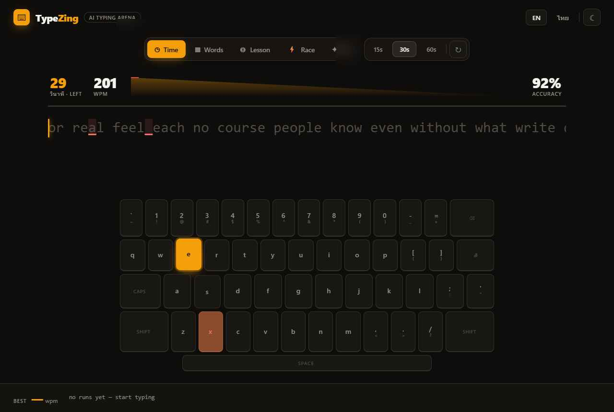
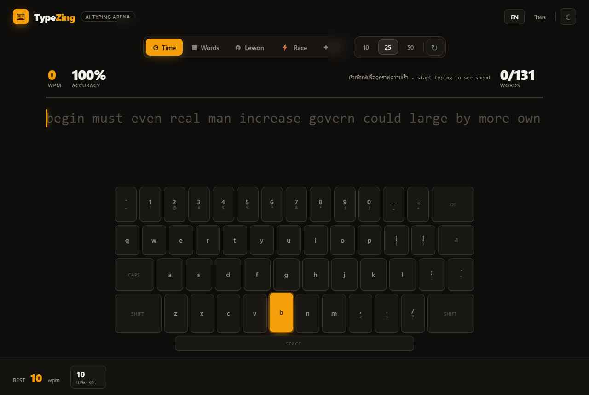
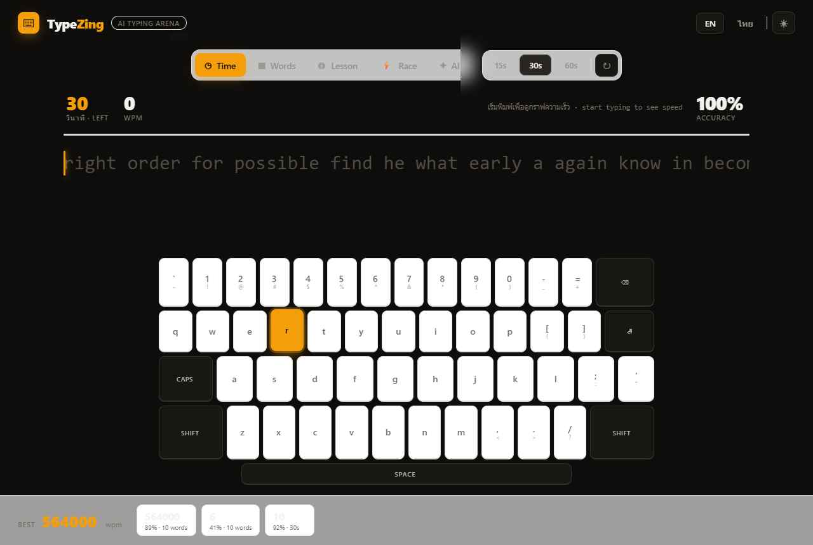

<div align="center">

# ⌨️ TypeZing — Typing Speed Arena

**A bilingual ไทย / English typing-speed trainer that runs entirely in your browser.**
*ฝึกพิมพ์เร็วสองภาษา ไทย–อังกฤษ ทำงานในเบราว์เซอร์ล้วน ๆ ไม่ต้องล็อกอิน*

[Live demo](https://kittanate-th.github.io/TypingSpeedZing/) · [Design doc](docs/superpowers/specs/2026-05-31-typezing-design.md) · [PRD](docs/PRD.md) · [SPEC](docs/SPEC.md) · [Plan](docs/PLAN.md)

  

</div>

## Why

English typing trainers are everywhere. Trainers that handle **Thai (Kedmanee)** *correctly* —
right keyboard map, right speed math for a language with no spaces between words — are rare.
TypeZing treats Thai as a first-class language next to English, and does it as a clean,
testable, dependency-light front-end project.

## Features

- **Five modes** — Time (15/30/60s) · Words (10/25/50) · Lesson (home/top/bottom/numbers/punctuation) · **Race** (vs. a real pace-ghost, Lv1–5) · **AI** (topic → passage).
- **Truly bilingual** — switch ไทย ↔ EN live. Thai uses the Kedmanee layout and shows **CPM** (honest for a spaceless language) alongside a labeled WPM-equivalent.
- **Live HUD** — WPM, accuracy, raw WPM, progress, and a speed sparkline while you type.
- **Rich results** — WPM-over-time chart, raw/chars/errors/time, and a personal-best badge.
- **On-screen keyboard** — next-key highlight, active-key flash, and an error **heatmap**; EN + Thai legends.
- **AI mode (offline)** — generate fresh practice passages locally, with no API key and no backend. A clean interface lets you wire in a real LLM later if you want.
- **Make it yours** — 3 visual directions (minimal / aurora / terminal), 4 accents, light/dark, glow — all persisted. Respects `prefers-reduced-motion`.
- **Private & free** — everything (history, settings, key) stays in your browser; static-hosted on GitHub Pages.

## Screenshots

> From the original design bundle (`typingspeedzing2026/`). Replace with live captures after deploy.

| Dark · typing | Result | Light · Thai |
|---|---|---|
|  |  |  |

## Tech stack

**Vite + React 18 + TypeScript** (strict). Runtime deps: just `react` + `react-dom`.
Styling is plain CSS with oklch design tokens. Tests run on **Vitest**. No backend.

```
src/
  engine/   headless typing logic (pure, unit-tested) — metrics, sampling, state machine
  data/     EN/TH word & quote banks, lessons, cleaned Thai→key map
  ai/       local passage generator (offline; async seam for a real LLM)
  i18n/     typed EN/TH dictionaries
  store/    settings + history (localStorage)
  components/  the React UI
```

See [SPEC.md](docs/SPEC.md) for architecture, data shapes, and the exact WPM/CPM/accuracy formulas.

## Getting started

```bash
npm install
npm run dev        # http://localhost:5173
npm test           # vitest — engine math, sampling, Thai keymap, AI fallback
npm run build      # tsc + vite → dist/
npm run preview    # serve the production build
```

### AI mode

Pick the **AI** mode, type a topic, and generate a passage. In v1 this runs **fully offline** —
text is assembled from the built-in banks, so there's no API key, no network call, and nothing
leaves your browser. The generator sits behind a small `generatePassage()` interface, so a real
LLM (a serverless route or your own key) can be added later without touching the UI.

## Deployment

Pushing to `main` triggers [`.github/workflows/deploy.yml`](.github/workflows/deploy.yml):
it installs, tests, builds with the correct Pages base path, and publishes `dist/` to
GitHub Pages. Enable Pages → "GitHub Actions" in repo settings once. Deploys cleanly to
Vercel/Netlify too (static build, no env required).

## Documentation

| Doc | What it covers |
|-----|----------------|
| [Design doc](docs/superpowers/specs/2026-05-31-typezing-design.md) | Source of truth: decisions, scope, architecture overview |
| [BASE](docs/BASE.md) | Vision, scope boundaries, glossary, decision log |
| [PRD](docs/PRD.md) | Personas, user stories, feature list, acceptance criteria |
| [SPEC](docs/SPEC.md) | Architecture, data shapes, formulas, i18n, AI contract, a11y |
| [PLAN](docs/PLAN.md) | Milestones, task checklist, verification |

## Credits

Visual design prototyped with [Claude Design](https://claude.ai/design) and re-implemented
as production code. Built by **Kittanate Thanee**.

## License

MIT © Kittanate Thanee
